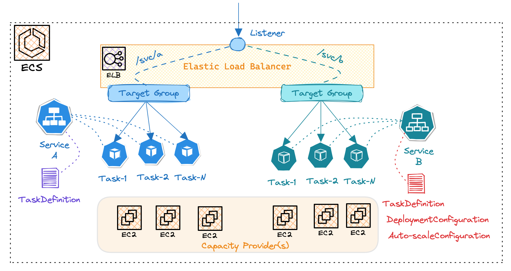
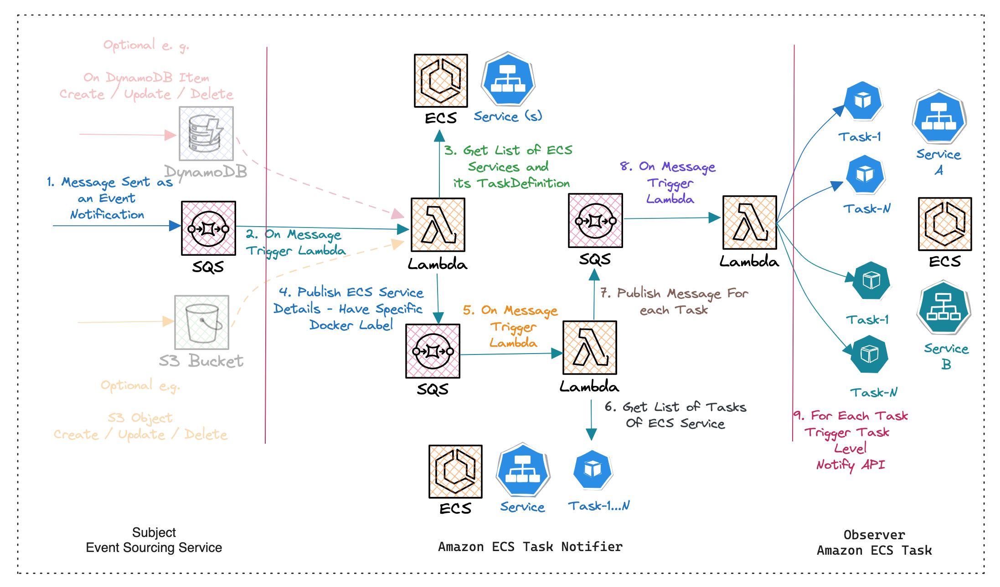
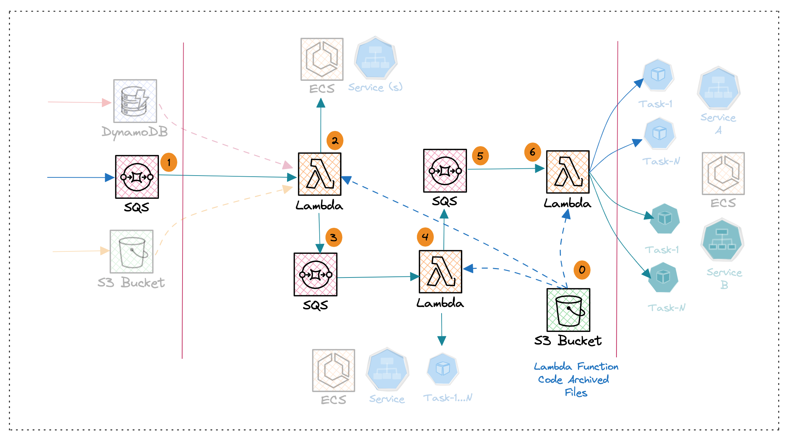

# Amazon Elastic Container Service (ECS)

Amazon Elastic Container Service (ECS) is a fully managed solution for container services that simplifies deployment, and auto-scaling and ensures high availability of containerized workloads.





**Capacity Providers:**

Amazon ECS capacity provider manages the scaling of infrastructure for tasks in the ECS cluster. Capacity providers are available for tasks that run on Fargate or Amazon EC2 instances.

**ECS Service:**

It represents the desired state of containerized application which includes 
- Task Definition - Defines the container image, CPU, memory requirements, and networking configuration.
- Deployment Configuration - Specifies the number of tasks to run and how deployments should be rolled out (e.g., blue/green deployments)
- Auto-scaling Configuration - Enables automatic scaling of tasks based on predefined metrics like CPU utilization or application load

**Traffic Routing:**

Amazon Elastic Load Balancer (ALB/NLB) is used to route the incoming traffic to healthy container instances running within ECS Service registered with a dedicated Target Group.


# Amazon ECS Service Task Notifier - Prototype

## Prototype Use-case Overview

<em>Notify each ECS Task running of an ECS Service having provision to notify running within an ECS Cluster using Event-Driven Architecture</em>

Consider a scenario where we need to notify an ECS task running within an ECS service about a specific event and based on that event, the containerized application needs to perform a certain action. In this case, simply passing requests through a routing won't be helpful, since the requests will only be handled by one of the ECS tasks.


## Prototype Solution Overview


### Design Considerations

- The containerized application is deployed as a microservices application utilizing REST APIs.
- The Task Definition includes a key-value pair under `dockerlabels` key, such as `NOTIFY_ME_CONTAINER_PORT` and  `NOTIFY_ME_API_URI`. This value indicates which ECS Services are candidates to receive event notifications.
- A container within the microservice application hosts a Notify API. e.g. /v1.0/notify. A Notify API is an internal private API.
- The Notify API is implemented using an asynchronous approach.
- The ECS Cluster utilizes EC2 instances as its capacity provider.
- The EC2 instances for the ECS Cluster run within private subnets of a VPC.

### Design Limitations
- Retrieving Private IP Addresses for the ECS Container Instances where clusters with huge numbers of nodes would need to be evaluated.




### Key components:

**Event Source Service(s):**

In an AWS environment, various services can function as subject to which state change we have to Notify each ECS Task. These may include DynamoDB streams, AWS S3 object lifecycle events, and messages/events received on Amazon SQS.

As part of the prototype implementation, I used SQS, to publish events to an Amazon SQS queue as an event notification. ECS tasks designated as event subscribers will be notified of these events by invoking a Notify API endpoint, for example, /v1.0/notify API.

```json
{
    "cluster": "ecs_cluster_name"
}
```

Note: Not all ECS services need to be event subscribers. By leveraging a dockerlabels configuration, we can identify ECS services implementing a "Notify API" (e.g., /v1.0/notify) and are thus eligible to receive event notifications. This convention simplifies deployment by avoiding unnecessary notifications to services that don't handle events.

**Task Notifier:**

The Task Notifier is implemented following the modern event-driven architecture pattern, leveraging AWS serverless services. Specifically, it utilizes three Lambda functions and two SQS queues to trigger notifications concurrently.

- ECS Service Discovery Lambda:

This Lambda function is triggered by messages in the observer SQS queue. It retrieves a list of all ECS services for the specified cluster and filters them based on specific key-value pairs, such as `NOTIFY_ME_CONTAINER_PORT` and `NOTIFY_ME_API_URI`, which are part of the `dockerlabels` section in the TaskDefinition. Subsequently, it prepares a message for each filtered ECS service and publishes it to the `ecs_service` SQS queue for further processing.


```json
{
    "cluster": "ecs_cluster_name",
    "service": "ecs_service_name",
    "notify_me_container_port": "notify_me_container_port",
    "notify_me_api_uri": "notify_me_api_uri"
}
```

- ECS Service Task Discovery Lambda:

Triggered by messages in the `ecs_service` SQS queue, this Lambda function retrieves details for all ECS tasks based on the cluster and service name provided. It gathers essential information, including IP address, host port, and notification API URI. Subsequently, it publishes these details to the `ecs_service_tasks` SQS queue for further processing.


```json
{
    "notify_task_arn": "notify_task_arn",
    "notify_me_host_address": "notify_me_host_address",
    "notify_me_host_port": "notify_me_host_port",
    "notify_me_api_uri": "notify_me_api_uri"
}
```

- ECS Service Task Notify Lambda:

Triggered by messages in the `ecs_service_tasks` SQS queue, this Lambda function executes the ECS Task Notification API for each task.


# Amazon ECS Service Task Notifier - Infrastructure

## Pre-requisites

- Two private subnet IDs within the VPC
- A Security Group configured for the Lambda function


## Infrastructure as Code

I utilized Terraform CDK (Cloud Development Kit) to provision the identified infrastructure design. Terraform CDK allows for programmatically defining cloud resources using familiar programming languages like Golang, Python or TypeScript, providing the flexibility to create infrastructure as code (IaC) in a scalable and maintainable manner. 

With Terraform CDK, I could efficiently model and deploy the ECS Task Notifier related AWS resources.




List of AWS Resources provisioned using Terraform CDK as follows.

| Sr.No. | AWS Service      | Name                                  | Purpose                         |
|--------|------------------|---------------------------------------|---------------------------------|
| 1      | SQS              | ecs_service_notification_aws_region   | Observer Service                |
| 2      | Lambda Function  | ecs_service_discovery                 | ECS Service Discovery           |
| 3      | SQS              | ecs_service_aws_region                | ECS Service Message             |
| 4      | Lambda Function  | ecs_service_task_discovery            | ECS Service Task Discovery      |
| 5      | SQS              | ecs_service_task_aws_region           | ECS Task Message                |
| 6      | Lambda Function  | ecs_service_task_notify               | ECS Service Task Notifier       |
| *      | S3 Bucket        | ecs_task_notifier_lambdas_aws_region | Lambda Function Archives  |


## Out of scope

- ECS cluster setup
- Deployment of microservices as a containerized application
- VPC network setup

# How to Use


- Setting up Terraform CDK

Follow the official documentation to setup Node.js and npm on your operating system.
Install Terraform CDK globally using npm. Run the following command

```shell
$ sudo npm install -g cdktf-cli

$ # validate installation
$ cdktf --version
```

- Setting up AWS CLI and configure

Follow the official documentation to setup AWS CLI and configure default profile having Administrator level rights.

- Github clone `ecs-task-notifier` repository

```shell
$ git clone https://github.com/jittakal/ecs-task-notifier.git
$ cd ecs-task-notifier
```

- Deploy ECS Task Notifier Stack

Update default values as per AWS pre-requisite setup

```golang
# main.go
awsRegion = "us-east-1"

_awsVpcPrivateSubnetId1   = "subnet-xxxxxxx"
_awsVpcPrivateSubnetId2   = "subnet-xxxxxxx"
_awsLambdaSecurityGroupId = "sg-xxxxxxx"
```

Deploy the stack

```shell
$ make get # required first time only

$ make lambda # build lambda binaries on linux by default

$ make deploy # deploy the stack
```

Publish a message to the SQS queue named `ecs_service_notification_aws_region` using the AWS Management Console or any sample test program. Afterward, monitor the AWS Lambda function logs to observe the execution and handling of the message does it trigger Notify API.


```json
{
    "cluster": "ecs_cluster_name"
}
```

Test Amazon ECS Task Notifier by publishing event to SQS.

```shell
$ # with default AWS_REGION=us-east-1
$ make test ECS_CLUSTER_NAME=your-cluster-name SQS_QUEUE_NAME=your-sqs-name

$ # with specified AWS_REGION
$ make test AWS_REGION=your-aws-region ECS_CLUSTER_NAME=your-cluster-name SQS_QUEUE_NAME=your-sqs-name
```

- Destroy ECS Task Notifier Stack

```shell
$ make destroy
```


# What Next?

- Implement Authentication Support for Notify API
- Pass Event Messages to Notify API
- Introduce Dead Letter Queue (DLQ)
- Audit Details to DynamoDB Table
- Validate for large-scale clusters comprising EC2 instances and ECS services.
- Add support for DynamoDB stream and AWS S3 object lifecycle event source.


# Reference

- [AWS blog reference use of SNS & SQS ](https://aws.amazon.com/blogs/compute/building-dynamic-amazon-sns-subscriptions-for-auto-scaling-container-workloads/)

Each container instance actively polls its designated ECS task-specific queue to receive messages and promptly acts upon them.
